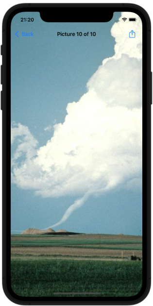

# Social Media

## Topics
UIBarButtonItem, UIActivityController

## Challenges

From [Hacking with Swift](https://www.hackingwithswift.com/read/3/3/wrap-up):
>1. Try adding the image name to the list of items that are shared. The activityItems parameter is an array, so you can add strings and other things freely. Note: Facebook won’t let you share text, but most other share options will.
>2. Go back to project 1 and add a bar button item to the main view controller that recommends the app to other people.
>3. Go back to project 2 and add a bar button item that shows their score when tapped.
## Screenshots

