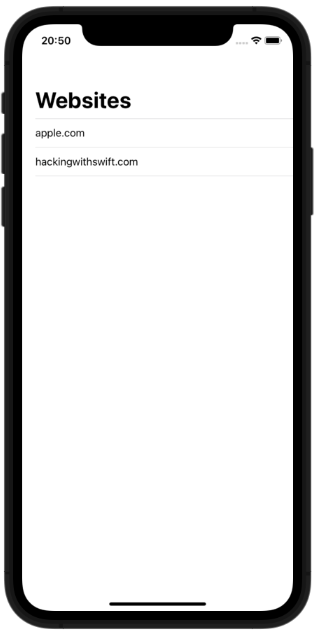
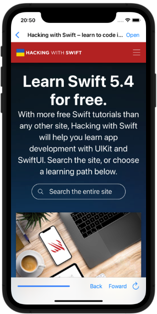

# Easy Browser

## Topics

WKWebView, Action sheets, UIToolbar, UIProgressView

## Challenges

From [Hacking with Swift](https://www.hackingwithswift.com/read/4/6/wrap-up):
>1. If users try to visit a URL that isn’t allowed, show an alert saying it’s blocked.
>2. Try making two new toolbar items with the titles Back and Forward. You should make them use webView.goBack and webView.goForward.
>3. For more of a challenge, try changing the initial view controller to a table view like in project 1, where users can choose their website from a list rather than just having the first in the array loaded up front.

## Screenshots

